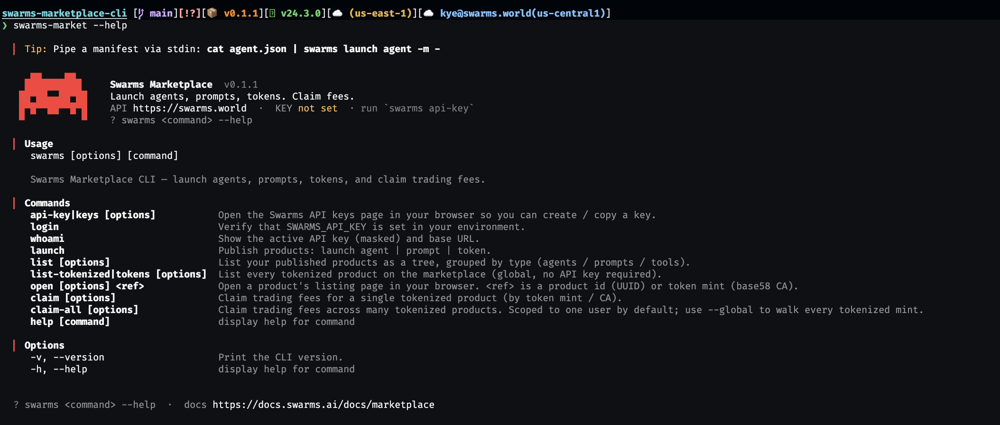

# Swarms Marketplace CLI



[](https://www.npmjs.com/package/swarms-market)
[](https://nodejs.org)
[](../LICENSE)

Die offizielle Kommandozeilen­schnittstelle für den [Swarms Marketplace](https://swarms.world). Veröffentlichen Sie Agents, Prompts und Tokens, durchsuchen Sie den Katalog und kassieren Sie Creator-Gebühren aus Ihren tokenisierten Produkten — vollständig vom Terminal aus, mit erstklassiger Unterstützung für Scripting, CI/CD und Headless-Umgebungen.

> 🌐 Andere Sprachen: [English](../README.md) · [中文](./README.zh-CN.md) · [日本語](./README.ja.md) · [हिन्दी](./README.hi.md) · [Polski](./README.pl.md) · [Português (BR)](./README.pt-BR.md) · [Français](./README.fr.md)

---

## Überblick

`swarms` ist ein vollständig skriptfähiger Client über der Swarms-Marketplace-HTTP-API. Er bildet direkt die Operationen ab, die ein Marketplace-Geschäft antreiben:

- **Produkte in großem Umfang veröffentlichen.** Pushen Sie Agents, Prompts und Tools über einen einzigen Befehl, ein JSON-Manifest oder ein Verzeichnis voller Manifeste in CI auf den Marketplace. Kein Browser, kein manuelles Formular.
- **On-Chain-Tokens starten.** Tokenisieren Sie einen Agent in einem Aufruf — inklusive Ticker, Quote-Währung, Bild und Gebührenmodus. Die Launch-Transaktion wird mit einem zur Laufzeit übergebenen Wallet-Schlüssel signiert.
- **Creator-Gebühren einzeln oder gesammelt kassieren.** Beanspruchen Sie Gebühren für einen einzelnen Token, für jeden Ihrer Tokens oder fegen Sie in einem Batch jeden tokenisierten Mint auf dem Marketplace ab — mit Continue-on-Failure-Semantik.
- **Ihren Katalog auditieren.** Rendern Sie Ihre veröffentlichten Produkte als strukturierten Baum, filtern Sie auf "nur tokenisiert" und geben Sie JSON für nachgelagerte Dashboards aus.
- **Den Marketplace entdecken.** Blättern Sie durch jedes tokenisierte Produkt (kein API-Key nötig) — als flache Liste oder als JSON, geeignet für Indexierung, Mirroring oder Analytics.
- **Alles automatisieren.** Jeder Befehl ist nicht-interaktiv, wenn die richtigen Umgebungs­variablen gesetzt sind, liefert Standard-Exit-Codes und deaktiviert Animationen/Prompts, wenn er außerhalb eines TTY oder unter `$CI` läuft.

### Fähigkeiten auf einen Blick

| Fähigkeit                                  | Befehl                                              | Authentifizierung nötig    |
| ------------------------------------------ | --------------------------------------------------- | -------------------------- |
| API-Keys-Seite öffnen                      | `swarms api-key`                                    | Keine                      |
| Umgebungs-Authentifizierung verifizieren   | `swarms login` · `swarms whoami`                    | API-Key                    |
| Agent veröffentlichen                      | `swarms launch agent`                               | API-Key                    |
| Prompt veröffentlichen                     | `swarms launch prompt`                              | API-Key                    |
| On-Chain-Token für einen Agent starten     | `swarms launch token`                               | API-Key + Wallet-Schlüssel |
| Veröffentlichte Produkte auflisten         | `swarms list`                                       | API-Key                    |
| Alle tokenisierten Produkte durchsuchen    | `swarms list-tokenized` (Alias `swarms tokens`)     | Keine                      |
| Listing-Seite eines Produkts öffnen        | `swarms open <id\|ca>`                              | Keine                      |
| Gebühren für einen einzelnen Mint claimen  | `swarms claim --ca <mint>`                          | Wallet-Schlüssel           |
| Gebühren stapelweise claimen               | `swarms claim-all`                                  | Wallet-Schlüssel           |
| JSON-Ausgabe für jeden Lesebefehl          | `--json`-Flag                                       | Wie der übergeordnete Befehl |

## Kompatibilität

| Anforderung    | Unterstützt                                                                   |
| -------------- | ----------------------------------------------------------------------------- |
| Node.js        | ≥ 18 (verwendet natives `fetch`)                                              |
| Paketmanager   | `npm`, `pnpm`, `yarn`, `bun`                                                  |
| OS             | macOS, Linux, Windows (PowerShell + WSL); macOS / Linux sind primär           |
| Terminals      | Jedes VT100-kompatible Terminal; Unicode-Blockzeichen erforderlich            |
| CI-Runner      | GitHub Actions, GitLab CI, CircleCI, Buildkite, Jenkins usw.                  |

## Installation

```bash
# Globale Installation (empfohlen für tägliche / Shell-Nutzung)
npm install -g swarms-market

# Oder ohne Installation ausführen (praktisch für CI)
npx swarms-market@latest --help

# In CI auf eine bestimmte Version pinnen
npm install -g swarms-market@0.1.0
```

Nach der Installation überprüfen:

```bash
swarms --version
swarms --help
```

> **Hinweis:** Der Paketname auf npm ist `swarms-market`, das installierte Binary heißt jedoch `swarms`. Falls Sie bereits das Python-Paket `swarms` installiert haben (es liefert ein gleichnamiges Binary aus), überschatten die beiden sich gegenseitig in Ihrem `PATH`. Führen Sie `which swarms` aus, um zu sehen, welches gewinnt; deinstallieren Sie das nicht benötigte oder rufen Sie dieses direkt über `npx swarms-market <command>` auf.

### Deinstallation

```bash
npm uninstall -g swarms-market
```

## Schnellstart

```bash
# 1. API-Key holen (öffnet https://swarms.world/platform/api-keys)
swarms api-key

# 2. Exportieren
export SWARMS_API_KEY="sk-…"
export SWARMS_USERNAME="your-username"   # optional, spart aber --user bei den meisten Befehlen

# 3. Auth verifizieren
swarms login

# 4. Ersten Agent aus einem Manifest veröffentlichen
swarms launch agent \
  --name "Hello Agent" \
  --description "Says hi" \
  --code-file ./agent.py \
  --free

# 5. Anzeigen, was Sie veröffentlicht haben
swarms list

# 6. Marketplace durchsuchen
swarms list-tokenized
```

## Authentifizierung

Holen Sie sich einen Key unter <https://swarms.world/platform/api-keys> (oder führen Sie `swarms api-key` aus). Keys können auf dieser Seite erstellt, benannt und widerrufen werden.

```bash
export SWARMS_API_KEY="sk-…"
swarms whoami      # bestätigt, dass der Key geladen ist; zeigt die ersten/letzten 4 Zeichen
```

Nur-lesende Befehle, die Ihr Konto nicht verändern (insbesondere `list-tokenized` und der `api-key`-Opener), funktionieren ohne API-Key. Alle anderen Befehle benötigen einen.

## Konfiguration

Die gesamte Konfiguration ist umgebungs­variablen­gesteuert. Die CLI liest oder schreibt keine Konfigurationsdatei.

| Variable                      | Zweck                                                                                          | Standardwert            |
| ----------------------------- | ---------------------------------------------------------------------------------------------- | ----------------------- |
| `SWARMS_API_KEY`              | Bearer-Token für Marketplace-Endpunkte (publish, list, kontoabhängige Reads).                  | _zur Auth erforderlich_ |
| `SWARMS_USERNAME`             | Standard-`--user` für `list`. Lässt `swarms list` ohne Flags laufen.                          | _(--user übergeben)_    |
| `SWARMS_WALLET_PRIVATE_KEY`   | Privater Wallet-Schlüssel (base58) für On-Chain-Operationen. Nur im Speicher gehalten.         | _(fragt, wenn nicht gesetzt)_ |
| `PRIVATE_KEY`                 | Alias für `SWARMS_WALLET_PRIVATE_KEY`, kompatibel mit gängigen `.env`-Konventionen.            | _(fragt, wenn nicht gesetzt)_ |
| `SWARMS_NO_ANIM`              | Auf beliebigen Wert setzen, um die Begrüßungs­animation auch im interaktiven Terminal zu deaktivieren. | _(animiert bei TTY)_  |
| `CI`                          | Deaktiviert die Begrüßungs­animation automatisch, wenn gesetzt (von jedem großen CI-Provider gesetzt). | _(erkannt)_         |
| `TERM=dumb`                   | Deaktiviert die Animation ebenfalls.                                                           | _(erkannt)_             |
| `NO_COLOR`                    | Von `chalk` respektiert — setzen, um ANSI-Farben vollständig zu deaktivieren. In manchen CI-Log-Viewern nützlich. | _(Farben standardmäßig an)_ |

## Befehlsreferenz

```
swarms api-key                Öffnet die API-Keys-Seite im Browser
swarms login                  Verifiziert, dass SWARMS_API_KEY gesetzt ist
swarms whoami                 Zeigt den aktiven Key (maskiert) und die Basis-URL

swarms launch agent           Veröffentlicht einen Agent
swarms launch prompt          Veröffentlicht einen Prompt
swarms launch token           Tokenisiert einen Agent on-chain

swarms list                   Ihre veröffentlichten Produkte, als rot/weißer Baum
swarms list-tokenized         Jedes tokenisierte Produkt auf dem Marketplace
                              (Alias: swarms tokens)
swarms open <id|ca>           Öffnet die Listing-Seite eines Produkts im Browser

swarms claim                  Gebühren für ein tokenisiertes Produkt claimen (per Token-Mint)
swarms claim-all              Gebühren über viele Produkte hinweg claimen
```

Führen Sie jederzeit `swarms <command> --help` aus, um die kanonische Flag-Liste zu erhalten. Die Hilfe für Unterbefehle (`swarms launch --help`, `swarms list-tokenized --help` usw.) verwendet dasselbe Rendering.

Für detaillierte Unterbefehl-Dokumentation, Manifest-Formate und Workflow-Beispiele siehe die [englische README](../README.md#command-reference).

## Sicherheitsmodell

Die CLI ist für Umgebungen konzipiert, in denen Zugangsdaten auditierbar und reproduzierbar sein müssen.

**Authentifizierung.**
Der API-Key wird ausschließlich aus `$SWARMS_API_KEY` gelesen und über HTTPS als `Authorization: Bearer <key>` gesendet. Die CLI schreibt, cached oder persistiert den API-Key nirgendwo auf der Festplatte. Keys werden unter <https://swarms.world/platform/api-keys> verwaltet und können jederzeit widerrufen werden.

**Umgang mit dem privaten Wallet-Schlüssel.**
Der von `claim`, `claim-all` und `launch token` benötigte private Wallet-Schlüssel wird in folgender Reihenfolge bezogen: explizites `--private-key`-Flag → `$SWARMS_WALLET_PRIVATE_KEY` → `$PRIVATE_KEY` → interaktiver Prompt (versteckte Eingabe, kein Echo, keine History). Der Schlüssel wird für die Dauer eines Befehls im Prozessspeicher gehalten und **niemals** auf die Festplatte geschrieben, geloggt oder gecached. Die CLI hat keinen "Wallet merken"-Modus.

**Transport.**
Alle Requests verwenden HTTPS zu `https://swarms.world`. Der Host ist hartkodiert — es gibt kein Env-Override — sodass eine fehlerhafte Shell-Variable den Bearer-Key oder den privaten Wallet-Schlüssel nicht auf einen anderen Host umleiten kann. Die CLI deaktiviert unter keiner Flag die TLS-Überprüfung.

**Telemetrie.**
Die CLI sendet keine Telemetrie jeglicher Art. Die einzigen Netzwerkaufrufe gehen an die in der [Befehlsreferenz](../README.md#command-reference) aufgeführten Marketplace-API-Endpunkte, und nur wenn ein Befehl aufgerufen wird, der sie benötigt.

## Exit-Codes

| Code | Bedeutung                                                                          |
| ---- | ---------------------------------------------------------------------------------- |
| 0    | Erfolg                                                                             |
| 1    | Befehlsfehler — ungültige Eingabe, Validierungsfehler, API-Non-2xx-Response        |
| 130  | Unterbrochen durch SIGINT (Ctrl-C); der Cursor wird beim Beenden wiederhergestellt |

`claim-all` liefert 1 zurück, wenn auch nur ein einzelner Claim fehlschlägt, selbst wenn andere erfolgreich waren; prüfen Sie die Zusammenfassungs­zeile am Ende der Ausgabe für den Status pro Mint.

## Lizenz

Apache License 2.0. Siehe [LICENSE](../LICENSE).
